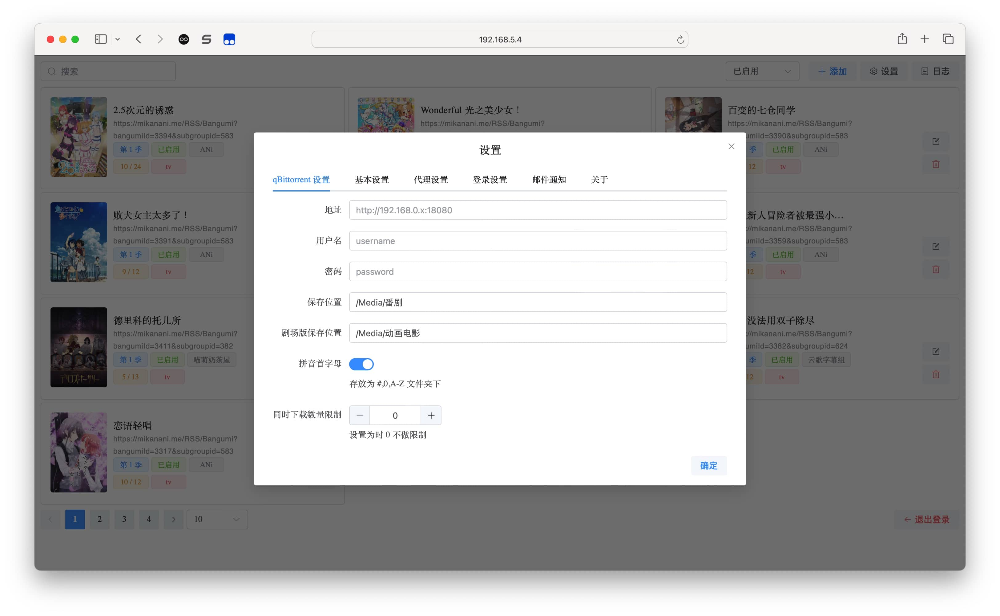
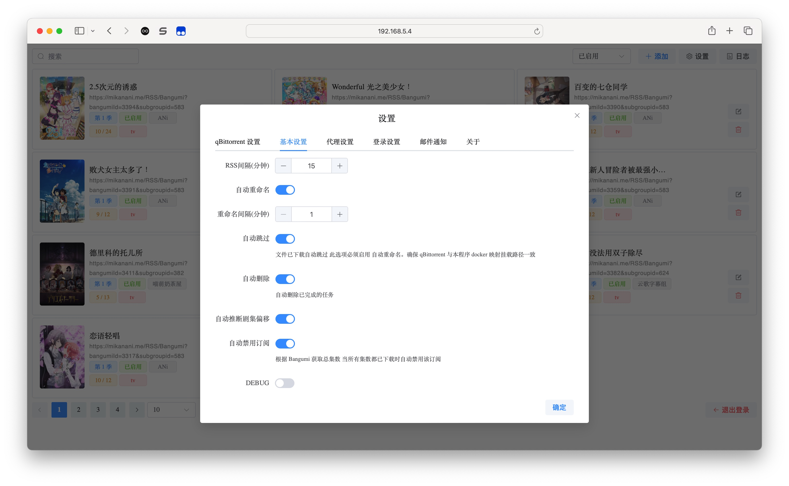
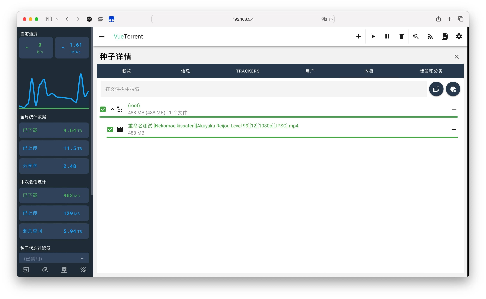
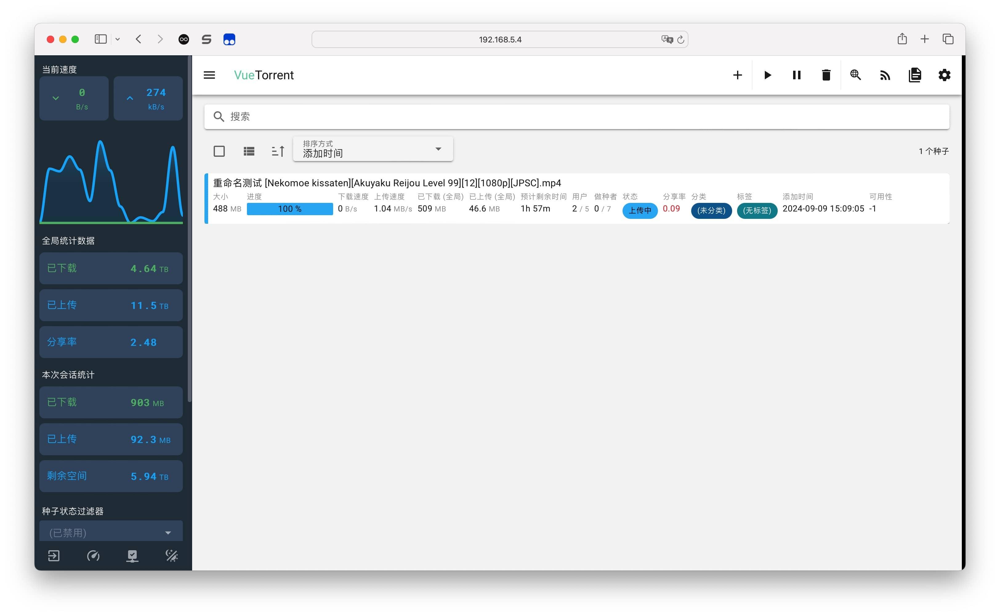
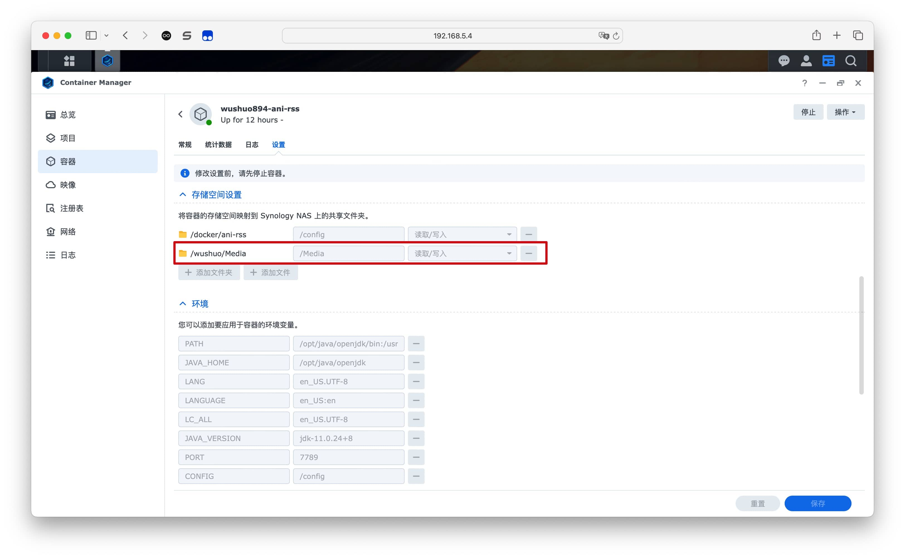
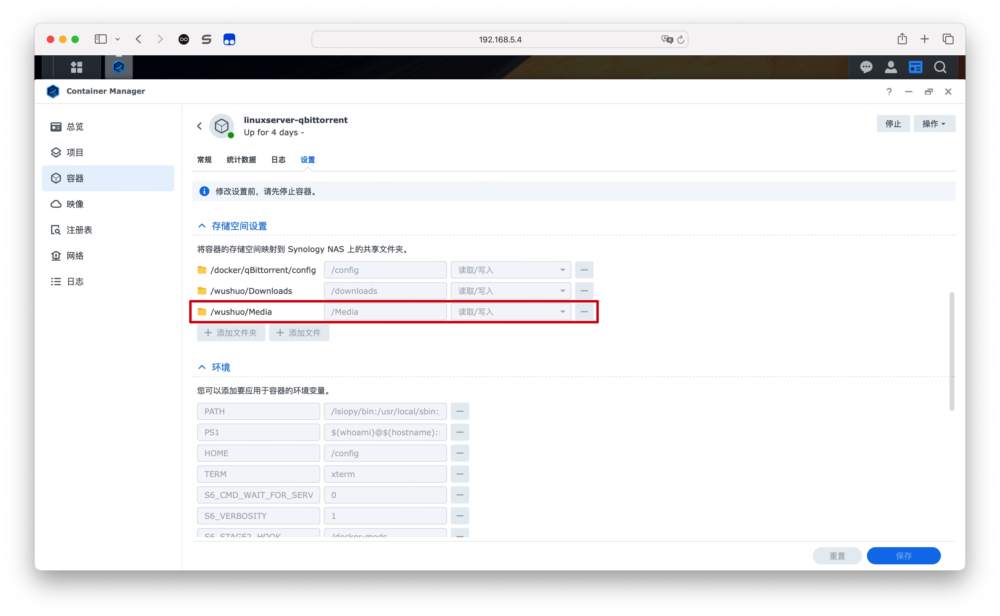
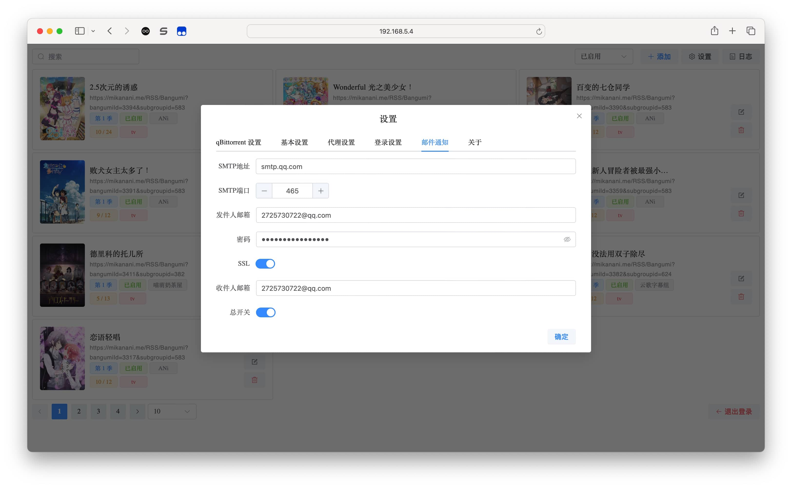

## 使用文档

### 下载设置

#### 下载工具

支持 <strong>Transmission</strong> <strong>qBittorrent</strong> <strong>Aria2</strong>

由于三种下载工具受 API 限制有各种不同的实现效果, 具体效果如下

| 名称           | 自动下载 | 下载时重命名 | 下载时复杂解构重命名 | 下载完成后重命名 |
|--------------|------|--------|------------|----------|
| qBittorrent  | √    | √      | √          | √        |
| Transmission | √    | √      | ×          | √        |
| Aria2        | √    | ×      | ×          | √        |

强烈推荐使用 **qBittorrent**

不支持下载时重命名会导致:

`在视频文件未重命名时已经有 emby 生成视频缩略图 .nfo 元数据,
当重命名后还会再次生成一次。且重命名后的视频再次被刮削到时 emby 触发 Webhook 通知。`

`个人喜欢使用 Webhook 通知让` [EmbyPinyin](https://github.com/wushuo894/EmbyPinyin) `(我的另一个项目) 处理中文拼音首字母索引`

**使用 Aria2 时，必须让 ani-rss 与 Aria2 路径保持一致才能自动重命名 详见** [docker映射挂载](#docker映射挂载)

#### 保存位置

下载器的保存位置 如果为空则 **不会进行下载**

### 剧场版保存位置

如果为空则使用 **下载位置**

#### 自动删除已完成任务

当下载器中已下载并 **完成做种** 后删除任务，不会删除本地文件

#### 拼音首字母

用于整理番剧到A-Z文件夹中
如:

    ├─A
    │  └─安达与岛村
    │      └─S01
    │              安达与岛村 S01E01.mp4
    │              安达与岛村 S01E02.mp4
    │              安达与岛村 S01E03.mp4
    │
    ├─B
    │  ├─BanG Dream! It's MyGO!!!!!
    │  │  └─S01
    │  │          BanG Dream! It's MyGO!!!!! S01E01.mp4
    │  │          BanG Dream! It's MyGO!!!!! S01E02.mp4
    │  │          BanG Dream! It's MyGO!!!!! S01E03.mp4

#### 季度

将番剧存放于 yyyy-MM 下 如 2024-07

#### 同时下载数量限制

防止同时下载任务过多导致qb卡死

强烈建议视性能设置, 推荐 1-2

**正在做种也会视为在下载中**

#### qb保存路径

开启后将使用qBittorrent的保存路径配置 (下载路径不受影响)

### 基本设置

#### Mikan

自定义mikan的域名

### 季命名

设置季命名方式 如 **Season 1** 、 **S1**

#### RSS开关

开启RSS更新

#### RSS间隔(分钟)

RSS更新检查的间隔，单位 分钟

#### 自动重命名

自动命名视频与字幕让其易于刮削

如:

    2024-09-01 13:29:06.865 [rss-task-thread] INFO  ani.rss.util.TorrentUtil - 添加下载 Wonderful 光之美少女！ S01E31
    2024-09-01 13:29:06.866 [rss-task-thread] INFO  ani.rss.util.TorrentUtil - 下载种子 Wonderful 光之美少女！ S01E31
    2024-09-01 13:29:46.352 [rename-task-thread] INFO  ani.rss.util.TorrentUtil - 重命名 [FLsnow][Wonderful_Precure！][31][1080P]/[FLsnow][Wonderful_Precure！][31][1080P].mkv ==> Wonderful 光之美少女！ S01E31.mkv
    2024-09-01 13:29:46.362 [rename-task-thread] INFO  ani.rss.util.TorrentUtil - 重命名 [FLsnow][Wonderful_Precure！][31][1080P]/[FLsnow][Wonderful_Precure！][31][1080P].cht.ass ==> Wonderful 光之美少女！ S01E31.cht.ass
    2024-09-01 13:29:46.365 [rename-task-thread] INFO  ani.rss.util.TorrentUtil - 重命名 [FLsnow][Wonderful_Precure！][31][1080P]/[FLsnow][Wonderful_Precure！][31][1080P].chs.ass ==> Wonderful 光之美少女！ S01E31.chs.ass
    2024-09-01 13:38:49.392 [rename-task-thread] INFO  ani.rss.util.TorrentUtil - 删除已完成任务 Wonderful 光之美少女！ S01E31

##### 重命名影响做种吗？

蜜柑是BT站, 重命名不会影响做种

如图上传流量所示

#### 重命名间隔(分钟)

单位 分钟

#### 自动跳过

自动检测季度文件夹下是否已经下载某集

支持的命名:

    ├─A
    │  └─安达与岛村
    │      ├─S1
    │      │       安达与岛村 S1E1.mp4
    │      ├─S01
    │      │       安达与岛村 S01E02.mp4
    │      ├─Season 1
    │      │       S1E3.mp4
    │      └─Season 01
    │              S01E04.mp4
    │              安达与岛村(2020) S1E5.mp4
    │              安达与岛村(2020) S01E06.mp4

PS: 此选项 **必须启用自动重命名**。确保 **下载工具** 与 **ani-rss** 的 docker 映射挂载路径 **保持一致**

##### docker映射挂载

如:

ani-rss:

    docker run -d \
    --name ani-rss \
    -v /volume1/docker/ani-rss/config:/config \
    -v /volume2/Media/:/Media \
    -p 7789:7789 \
    -e PORT="7789" \
    -e CONFIG="/config" \
    -e TZ=Asia/Shanghai \
    --restart always \
    wushuo894/ani-rss

qbittorrent:

    docker run -d --name qbittorrent \
    -v /volume1/docker/qbittorrent/config:/config \
    -v /volume2/downloads:/downloads \
    -v /volume2/Media/:/Media \
    -p 8080:8080 \
    -p 6881:6881 \
    linuxserver/qbittorrent

其中 ani-rss 设置中的 **保存位置** 位于 `/Media` 下

两者 `/Media` 挂载路径一致 `-v /volume2/Media/:/Media`

截图示例：

确保 下载工具 与 ani-rss 的 docker 映射挂载路径一致

#### 自动推断剧集偏移

当添加RSS时会根据最小集数计算出集数偏移

如 无职转生 第二季 是从 第 0 集开始的 则自动识别偏移为 1

如 我推的孩子 第二季 有些字幕组是从第 12 集开始的 则自动识别偏移为 -11

主要看你的个人喜好决定是否开启

#### TMDB

当添加订阅时会自动查询并使用 TMDB 获得的标题

#### 自动禁用订阅

根据 Bangumi 获取总集数 当所有集数都已下载时自动禁用该订阅

#### 标题添加年份

如 魔王军最强的魔术师是人类 (2024)

### 自动跳过X.5集

程序本身是 **不支持** .5的重命名的，因为.5和S00E0X没有 **明确的关系**

### 备用RSS

请勿将 **动漫花园的rss** 用作 **其他rss** 的备用或主RSS

使用备用rss请同时开启qb的 **修改任务标题**, 对tr兼容性 **不太稳定**, 且此功能 **不支持** aria2

若开启了 **自动删除** 将会 **自动替换** 备用rss 为 **主rss** 版本 (
需要映射路径与下载器一致，否则若旧视频为mp4新视频为mkv时无法完成自动删除旧视频)

### 遗漏检测

若检测到RSS中集数出现遗漏会发送通知

### BgmToken

你可以在 <a target="_blank" href="https://next.bgm.tv/demo/access-token">https://next.bgm.tv/demo/access-token</a>
生成一个 Access Token

设置 BgmToken 后支持自动点格子

#### Emby-Webhook通知设置

    名称: bgm
    url: http://[IP]:7789/api/web_hook
    请求内容类型: application/json
    勾选: 播放, 用户-标记为已播放, 用户-标记为未播放
    将媒体库事件限制为：番剧

如果你没有设置ApiKey, 默认只有内网能够访问webhook

设置ApiKey后请将url改为

    http://[IP]:7789/api/web_hook?s=[ApiKey]

### ip白名单

名单中的ip将不会校验登录

示例:

    127.0.0.1
    192.168.5.0/24
    192.165.5.10-192.165.5.254
    192.168.5.*
    192.168.*.*

#### DEBUG

可以看到 debug 级别的日志

    2024-09-03 14:26:01 INFO ani.rss.util.TorrentUtil - 已下载 深夜冲击 S01E01
    2024-09-03 14:26:01 INFO ani.rss.util.TorrentUtil - 下载种子 深夜冲击 S01E01
    2024-09-03 14:26:02 DEBUG ani.rss.util.TorrentUtil - 本地文件已存在 深夜冲击 S01E01
    2024-09-03 14:26:02 DEBUG ani.rss.util.TorrentUtil - {
    "title": "[ANi] Mayonaka Punch /  深夜 Punch - 02 [1080P][Baha][WEB-DL][AAC AVC][CHT][MP4]",
    "reName": "深夜冲击 S01E02",
    "torrent": "https://mikanani.me/Download/20240715/1ef6e3168b72cef9a30edb9b97490158629ba7d0.torrent",
    "episode": 2
    }
    2024-09-03 14:26:02 INFO ani.rss.util.TorrentUtil - 已下载 深夜冲击 S01E02
    2024-09-03 14:26:02 INFO ani.rss.util.TorrentUtil - 下载种子 深夜冲击 S01E02
    2024-09-03 14:26:03 DEBUG ani.rss.util.TorrentUtil - 本地文件已存在 深夜冲击 S01E02
    2024-09-03 14:26:03 DEBUG ani.rss.util.TorrentUtil - {
    "title": "[ANi] Mayonaka Punch /  深夜 Punch - 03 [1080P][Baha][WEB-DL][AAC AVC][CHT][MP4]",
    "reName": "深夜冲击 S01E03",
    "torrent": "https://mikanani.me/Download/20240722/ec1ec2faf5356d4b363e42d99b799d31450bc34d.torrent",
    "episode": 3
    }

### 全局排除

支持 <a href="https://www.runoob.com/regexp/regexp-syntax.html" target="_blank">正则表达式</a>

推荐排除规则

[https://www.bilibili.com/read/cv36327276](https://www.bilibili.com/read/cv36327276)

### 代理设置

主要用于访问 mikan

### 登录设置

设置网页的账号与密码

### 邮件通知

当有新番开始下载时向邮箱发送通知

#### QQ邮箱设置示例

    SMTP地址: smtp.qq.com
    SMTP端口: 465
    发件人邮箱: [qq号]@qq.com
    密码: xxxx
    SSL: 开启
    收件人邮箱: [qq号]@qq.com

#### QQ邮箱密码:

QQ邮箱 - 常规 - 第三方服务 - IMAP/SMTP服务

开启并 生成授权码

### 关于剧场版

若 `剧场版保存位置` 为空则使用 `保存位置`

由于剧场版命名与文件结构各异, 故并不会使用重命名功能

[快速开始](start) | [Docker 部署](docker)

### 相关文章:

[猫猫博客 Docker 部署 ani-rss 实现自动追番](https://catcat.blog/docker-ani-rss.html)

[从零开始的NAS生活 第四回：ANI-RSS，自动追番！](https://www.wtsss.fun/archives/qhaQ3M7v)

[自动化追番计划](http://jinghuashang.cn/posts/8f622332.html)