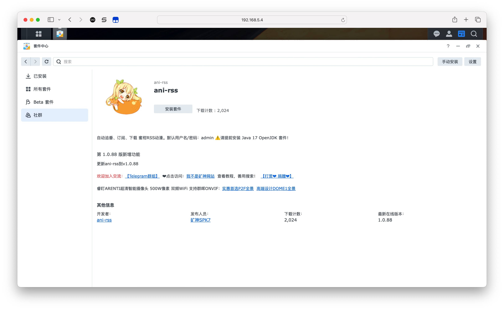

## 快速开始

[群晖NAS](#群晖nas)

### Windows

分为两个版本

[ani-rss.win.x86_64.zip](https://github.com/wushuo894/ani-rss/releases/latest) 自带jdk, 解压后即可运行

[ani-rss-launcher.exe](https://github.com/wushuo894/ani-rss/releases/latest) 需要 [自行安装jdk](#windows)

运行后 **右下角会出现托盘** 可通过其打开浏览器

### 安装 java

推荐使用 jdk11 或 jdk17
如果已经有了可以跳过

##### Windows

    winget install 'OpenJDK 11'

##### Linux

    sudo apt update
    sudo apt install openjdk-11-jdk

#### macOS

    brew update
    brew install openjdk@11

### 运行

下载最新的 **ani-rss-jar-with-dependencies.jar** [链接](https://github.com/wushuo894/ani-rss/releases/latest)

    java -jar -Xmx2g ./ani-rss-jar-with-dependencies.jar --port 7789

使用 `--gui` 参数使 桌面端 显示托盘

#### 脚本运行 支持自动重启

    wget https://github.com/wushuo894/ani-rss/raw/master/docker/run.sh
    sudo chmod -R 777 ./run.sh
    sudo bash ./run.sh

通过 **http://[ip]:7789** 访问

### 群晖NAS

**请提前安装 Java 17 OpenJdk 套件**

离线安装 [ani-rss_v1.1.55_noarch-DSM7.spk](https://github.com/wushuo894/ani-rss/releases/download/v1.1.55/ani-rss_v1.1.55_noarch-DSM7.spk)

或者

使用矿神套件源 `https://spk7.imnks.com` , 搜索 `ani-rss` 安装

<a href="docs">使用文档</a>
|
<a href="docker">Docker部署</a>

### 相关文章:

[猫猫博客 Docker 部署 ani-rss 实现自动追番](https://catcat.blog/docker-ani-rss.html)

[从零开始的NAS生活 第四回：ANI-RSS，自动追番！](https://www.wtsss.fun/archives/qhaQ3M7v)

[自动化追番计划](http://jinghuashang.cn/posts/8f622332.html)

