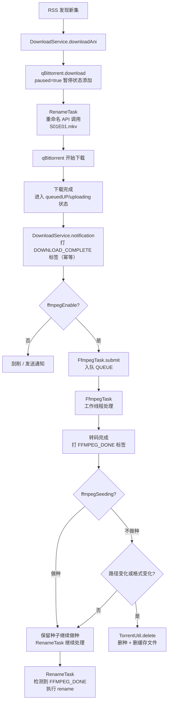
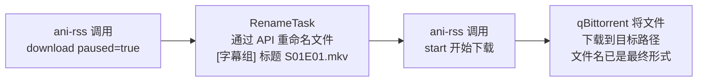
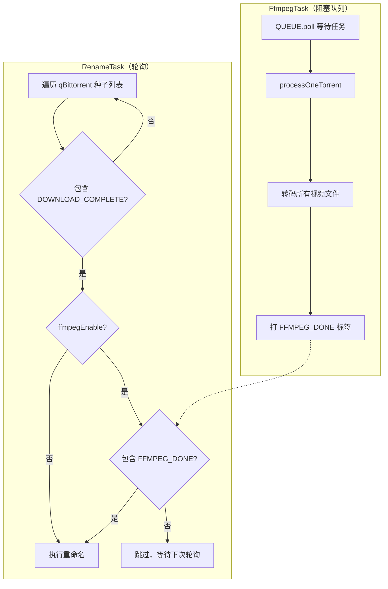
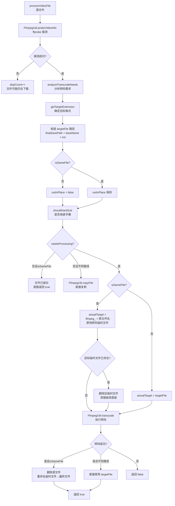
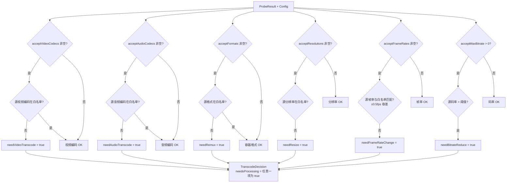
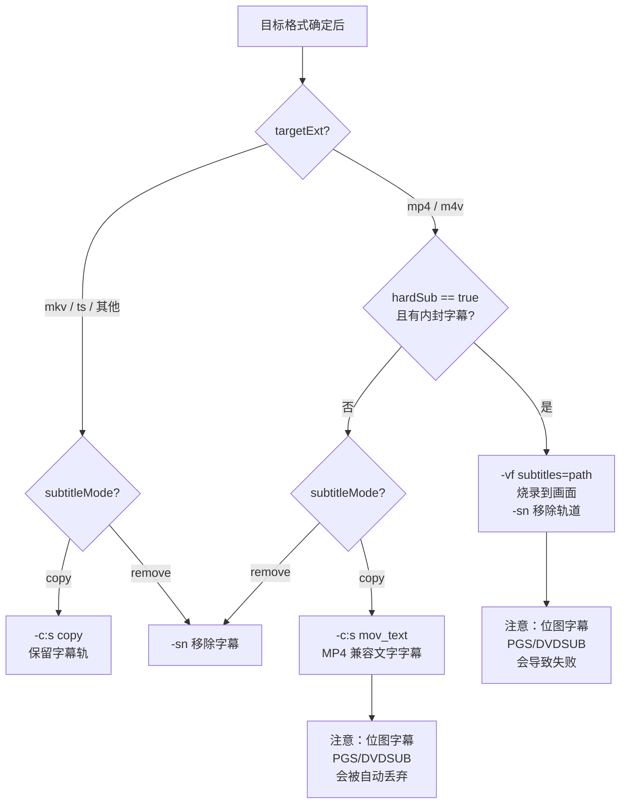
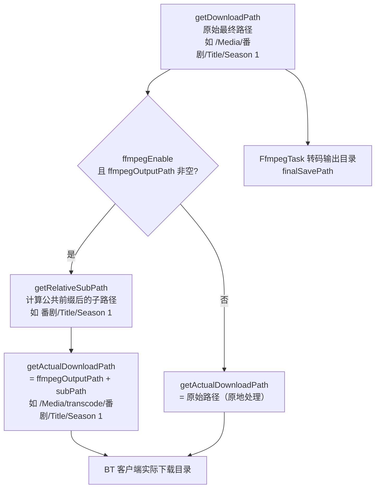
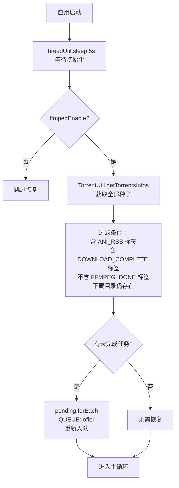
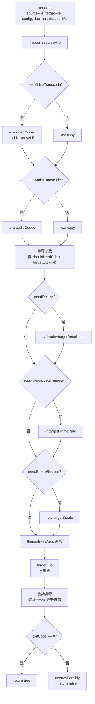

# FFmpeg 转码流水线 — 架构与原理文档

## 概述

ani-rss 的 FFmpeg 转码功能在 BT 下载完成后、重命名前，对视频文件进行转码处理。
整个流水线通过 qBittorrent **标签（Tag）** 协调三个核心组件：`DownloadService`、`FfmpegTask`、`RenameTask`。

---

## 整体流程




---

## qBittorrent 文件命名时机




> **关键约定**：qBittorrent 在下载开始 **之前** 文件名已经是最终形式（如 `Title S01E01.mkv`）。
> 因此 `FfmpegUtil` 可直接使用 `FileUtil.mainName(sourceFile)` 作为输出文件名，无需从种子名推断。

---

## RenameTask 与 FfmpegTask 协调




---

## FfmpegTask 详细处理流程

```mermaid
flowchart TD
    Start([工作线程启动]) --> A["findAniByDownloadPath<br/>反查订阅信息"]
    A --> B{订阅存在?}
    B -- 否 --> C["打 FFMPEG_DONE<br/>解除 RenameTask 阻塞"]
    B -- 是 --> D["resolveSourceDir<br/>确定源文件目录"]
    D --> E{目录存在?}
    E -- 否 --> F["等待 10s<br/>重新入队"]
    E -- 是 --> G["listFileList<br/>遍历顶层文件"]

    G --> H{文件类型}
    H -- 视频文件 --> I[processVideoFile]
    H -- 字幕文件 --> J["复制到 finalSavePath<br/>跟踪 allInPlace"]
    H -- 其他 --> K[跳过]

    I --> L{成功/跳过?}
    L -- 成功 --> M[successCount++]
    L -- 跳过 --> N[skipCount++]

    J --> O{复制成功?}
    O -- 是 --> P[subtitleCount++]
    O -- 否 --> N

    M --> Q{全部文件处理完成}
    N --> Q
    P --> Q

    Q --> R{successCount>0 且 skipCount==0?}
    R -- 是 --> S["打 FFMPEG_DONE"]
    R -- 否 --> T{successCount==0 且 skipCount==0?}
    T -- 是 --> U["打 FFMPEG_DONE<br/>防止 RenameTask 永久阻塞"]
    T -- 否 --> V["等待 10s<br/>重新入队（文件仍在下载）"]

    S --> W{ffmpegSeeding?}
    W -- 做种 --> X{原地转码?}
    X -- 是 --> End([结束])
    X -- 否 --> Y["TorrentUtil.delete<br/>删种 + 删缓存"]
    W -- 不做种 --> Z{diffPath || !allInPlace?}
    Z -- 是 --> Y
    Z -- 否 --> End
    Y --> End
```


---

## 单个视频文件转码决策




---

## 转码需求分析（analyzeTranscodeNeeds）




---

## 字幕处理策略




---

## 路径计算逻辑




**路径计算示例：**


| ffmpegOutputPath   | getDownloadPath      | getActualDownloadPath          |
| ------------------ | -------------------- | ------------------------------ |
| 空                  | `/Media/番剧/Title/S1` | `/Media/番剧/Title/S1`（原地）       |
| `/Media/transcode` | `/Media/番剧/Title/S1` | `/Media/transcode/番剧/Title/S1` |
| `/Media/transcode` | `/Media/517057`      | `/Media/transcode/517057`      |


---

## 应用重启恢复（recoverPending）




---

## FFmpeg 命令构造（transcode）




---

## 配置项说明


| 配置键                       | 类型      | 默认值       | 说明                  |
| ------------------------- | ------- | --------- | ------------------- |
| `ffmpegEnable`            | Boolean | false     | 转码总开关               |
| `ffmpegPath`              | String  | `ffmpeg`  | ffmpeg 可执行文件路径      |
| `ffprobePath`             | String  | `ffprobe` | ffprobe 可执行文件路径     |
| `ffmpegOutputPath`        | String  | `""`      | 转码目标目录，空=原地转码       |
| `ffmpegAcceptVideoCodecs` | List    | `[]`      | 视频编码白名单，空=不检测       |
| `ffmpegVideoCodec`        | String  | `""`      | 目标视频编码，空=copy       |
| `ffmpegAcceptAudioCodecs` | List    | `[]`      | 音频编码白名单，空=不检测       |
| `ffmpegAudioCodec`        | String  | `""`      | 目标音频编码，空=copy       |
| `ffmpegAcceptFormats`     | List    | `[]`      | 容器格式白名单，空=不检测       |
| `ffmpegFormat`            | String  | `""`      | 目标容器格式，空=保持原格式      |
| `ffmpegCrf`               | Integer | 23        | CRF 质量参数（0-51）      |
| `ffmpegPreset`            | String  | `medium`  | 编码预设                |
| `ffmpegSubtitleMode`      | String  | `copy`    | 字幕处理方式（copy/remove） |
| `ffmpegHardSub`           | Boolean | false     | MP4 烧录内封字幕          |
| `ffmpegSeeding`           | Boolean | true      | 转码后继续做种             |
| `ffmpegMaxConcurrent`     | Integer | 1         | 最大并发转码数             |
| `ffmpegSleepSeconds`      | Integer | 30        | 队列空闲等待时间（秒）         |
| `ffmpegAcceptResolutions` | List    | `[]`      | 分辨率白名单（如 1080p）     |
| `ffmpegTargetResolution`  | String  | `""`      | 目标分辨率（如 -2:1080）    |
| `ffmpegAcceptFrameRates`  | List    | `[]`      | 帧率白名单（如 24、30）      |
| `ffmpegTargetFrameRate`   | String  | `""`      | 目标帧率                |
| `ffmpegAcceptMaxBitrate`  | Integer | 0         | 最大可接受码率（kbps，0=不检测） |
| `ffmpegTargetBitrate`     | String  | `""`      | 目标码率（如 4000k、2M）    |


---

## 边界情况与错误处理


| 场景                    | 处理方式                                                   |
| --------------------- | ------------------------------------------------------ |
| 订阅已被删除                | 打 `FFMPEG_DONE`，解除 RenameTask 阻塞，跳过处理                  |
| 源文件目录不存在              | 等待 10s 后重新入队，下次轮询重试                                    |
| ffprobe 探测失败（文件仍在写入）  | `skipCount++`，任务重新入队                                   |
| 目录内无可处理视频文件           | 打 `FFMPEG_DONE`，防止 RenameTask 永久阻塞                     |
| 部分文件跳过（仍在下载）          | 等待 10s 后整个任务重新入队                                       |
| FFmpeg 进程崩溃/被中断       | 兜底 `catch` 块打 `FFMPEG_DONE`，防止死锁                       |
| 应用重启，任务未完成            | `recoverPending()` 重新扫描并入队                             |
| 原地转码临时文件遗留            | 转码前检测 `.ffmpeg_` 前缀文件并删除                               |
| 已存在目标文件（非原地）          | 直接跳过，返回 `true`                                         |
| 连接下载器失败               | 等待后将任务重新入队                                             |
| ffmpegCachePath（旧配置键） | `migrateOldFfmpegCachePath()` 自动迁移到 `ffmpegOutputPath` |


---

## Docker 部署说明

FFmpeg **不内置**于 Docker 镜像，有两种方案：

**方案一：系统包（推荐简单场景）**

在 `Dockerfile` 中启用注释行：

```dockerfile
RUN apk add --no-cache ffmpeg
```

**方案二：挂载静态编译版本（推荐生产环境）**

```yaml
# docker-compose.yml
volumes:
  - /path/to/static-ffmpeg:/usr/local/bin/ffmpeg:ro
  - /path/to/static-ffprobe:/usr/local/bin/ffprobe:ro
```

在 ani-rss 配置中设置：

- FFmpeg 路径：`/usr/local/bin/ffmpeg`
- FFprobe 路径：`/usr/local/bin/ffprobe`

---

## 关键代码位置索引


| 功能                   | 文件                     | 方法                                       |
| -------------------- | ---------------------- | ---------------------------------------- |
| 转码任务入队               | `DownloadService.java` | `notification()`                         |
| 转码主循环                | `FfmpegTask.java`      | `run()`                                  |
| 单种子处理                | `FfmpegTask.javagit`   | `processOneTorrent()`                    |
| 单视频文件处理              | `FfmpegTask.java`      | `processVideoFile()`                     |
| 源目录查找                | `FfmpegTask.java`      | `resolveSourceDir()`                     |
| 重启恢复                 | `FfmpegTask.java`      | `recoverPending()`                       |
| 视频信息探测               | `FfmpegUtil.java`      | `probeVideoInfo()`                       |
| 转码需求分析               | `FfmpegUtil.java`      | `analyzeTranscodeNeeds()`                |
| 执行转码                 | `FfmpegUtil.java`      | `transcode()`                            |
| 字幕烧录判断               | `FfmpegUtil.java`      | `shouldHardSub()`                        |
| 下载路径计算               | `DownloadService.java` | `getDownloadPath()`                      |
| 实际下载路径               | `DownloadService.java` | `getActualDownloadPath()`                |
| 配置加载与迁移              | `ConfigUtil.java`      | `load()` / `migrateOldFfmpegCachePath()` |
| RenameTask FFmpeg 门控 | `RenameTask.java`      | `rename()` 中的 FFMPEG_DONE 检查             |


